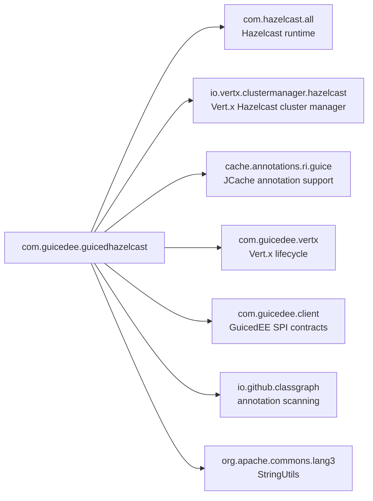

# GuicedEE Hazelcast

[](https://github.com/GuicedEE/GuicedHazelcast/actions/workflows/build.yml)
[](https://central.sonatype.com/artifact/com.guicedee/hazelcast)
[](https://www.apache.org/licenses/LICENSE-2.0)


**Annotation-driven Hazelcast integration** for the [GuicedEE](https://github.com/GuicedEE) / Vert.x stack.
Declare server and client configuration with annotations — everything is discovered at startup via ClassGraph, wired through Guice, and automatically configures the Vert.x Hazelcast cluster manager for clustered event-bus and distributed data structures.

Built on [Hazelcast](https://hazelcast.com/) · [Vert.x Hazelcast Cluster Manager](https://vertx.io/docs/vertx-hazelcast/java/) · [Google Guice](https://github.com/google/guice) · [JCache (JSR-107)](https://jcp.org/en/jsr/detail?id=107) · JPMS module `com.guicedee.guicedhazelcast` · Java 25+

## 📦 Installation

```xml
<dependency>
  <groupId>com.guicedee</groupId>
  <artifactId>hazelcast</artifactId>
</dependency>
```

<details>
<summary>Gradle (Kotlin DSL)</summary>

```kotlin
implementation("com.guicedee:hazelcast:2.0.1-SNAPSHOT")
```
</details>

## ✨ Features

- **Annotation-driven setup** — `@HazelcastServerOptions` and `@HazelcastClientOptions` declare the full Hazelcast configuration
- **Auto-discovery** — `HazelcastPreStartup` / `HazelcastClientPreStartup` scan the classpath via ClassGraph to find annotated declarations
- **Vert.x cluster integration** — `HazelcastClusterConfigurator` automatically registers itself as the Vert.x cluster manager via SPI, enabling clustered event-bus, distributed maps, locks, and counters
- **Guice-managed instances** — `HazelcastInstance` is injectable as a singleton via Guice
- **JCache support** — `CachingProvider`, `CacheManager`, and `@CacheResult` / `@CachePut` / `@CacheRemove` annotations via JSR-107
- **SPI customization** — `IGuicedHazelcastServerConfig` and `IGuicedHazelcastClientConfig` hooks for programmatic configuration
- **Multiple join strategies** — Multicast, TCP-IP, Kubernetes, or None (standalone)
- **Environment variable overrides** — every annotation attribute can be overridden via `HAZELCAST_*` / `HAZELCAST_CLIENT_*` environment variables
- **Graceful shutdown** — all Hazelcast instances are shut down on application destroy

## 🚀 Quick Start

### Embedded Server (Standalone)

**Step 1** — Annotate a class or `package-info.java` with `@HazelcastServerOptions`:

```java
@HazelcastServerOptions(
    clusterName = "my-cluster",
    startLocal = true,
    joinType = HazelcastServerOptions.JoinType.NONE
)
public class MyApp {
    public static void main(String[] args) {
        IGuiceContext.registerModule("my.app");
        IGuiceContext.instance().inject();

        // Access the embedded Hazelcast instance
        HazelcastInstance hz = HazelcastPreStartup.getInstance();
        IMap<String, String> map = hz.getMap("my-map");
        map.put("key", "value");
    }
}
```

### Clustered Server (Vert.x Event Bus)

When using `@HazelcastServerOptions` with a join type other than `NONE`, the Vert.x event bus is automatically clustered:

```java
@HazelcastServerOptions(
    clusterName = "my-cluster",
    startLocal = true,
    joinType = HazelcastServerOptions.JoinType.TCP,
    tcpMembers = "192.168.1.10,192.168.1.11"
)
public class ClusteredApp {}
```

The `HazelcastClusterConfigurator` is automatically discovered by ServiceLoader and configures Vert.x to use `buildClustered()` with the Hazelcast cluster manager.

### Client Mode

Connect to a remote Hazelcast cluster:

```java
@HazelcastClientOptions(
    clusterName = "my-cluster",
    addresses = "192.168.1.10:5701,192.168.1.11:5701"
)
public class ClientApp {
    public static void main(String[] args) {
        IGuiceContext.registerModule("my.app");
        IGuiceContext.instance().inject();

        HazelcastInstance hz = HazelcastClientPreStartup.getClientInstance();
        IMap<String, String> map = hz.getMap("my-map");
        System.out.println(map.get("key"));
    }
}
```

**Step 2** — Configure `module-info.java`:

```java
module my.app {
    requires com.guicedee.guicedinjection;
    requires com.guicedee.guicedhazelcast;
    exports my.app;
    opens my.app to com.google.guice;
}
```

**Step 3** — Bootstrap:

```java
IGuiceContext.instance().inject();
```

## 📐 Architecture

```mermaid
flowchart TD
    n1["Startup"]
    n2["IGuiceContext.instance()"]
    n1 --> n2
    n3["HazelcastPreStartup<br/>IGuicePreStartup — server annotation scanning, sort=MIN+70"]
    n2 --> n3
    n4["Discovers @HazelcastServerOptions<br/>classes and package-info.java"]
    n3 --> n4
    n5["Wraps with environment variable resolution<br/>HAZELCAST_*"]
    n3 --> n5
    n6["Applies SPI hooks<br/>IGuicedHazelcastServerConfig"]
    n3 --> n6
    n7["Starts embedded instance if startLocal=true"]
    n3 --> n7
    n8["HazelcastClientPreStartup<br/>IGuicePreStartup — client annotation scanning, sort=MIN+71"]
    n2 --> n8
    n9["Discovers @HazelcastClientOptions"]
    n8 --> n9
    n10["Wraps with environment variable resolution<br/>HAZELCAST_CLIENT_*"]
    n8 --> n10
    n11["Applies SPI hooks<br/>IGuicedHazelcastClientConfig"]
    n8 --> n11
    n12["Connects to remote cluster"]
    n8 --> n12
    n13["HazelcastBinderGuice<br/>IGuiceModule — Guice bindings"]
    n2 --> n13
    n14["Binds HazelcastInstance singleton<br/>via HazelcastClientProvider"]
    n13 --> n14
    n15["Binds CachingProvider and CacheManager<br/>JCache"]
    n13 --> n15
    n16["Installs CacheAnnotationsModule<br/>@CacheResult, @CachePut, @CacheRemove"]
    n13 --> n16
    n17["HazelcastClusterConfigurator<br/>VertxConfigurator SPI — Vert.x cluster manager"]
    n2 --> n17
    n18["Configures Vert.x to use HazelcastClusterManager<br/>triggers buildClustered()"]
    n17 --> n18
    n19["Shutdown"]
    n20["HazelcastPreDestroy<br/>IGuicePreDestroy — shutdown, sort=MAX-100"]
    n19 --> n20
    n21["Shuts down client instance"]
    n20 --> n21
    n22["Shuts down server instance"]
    n20 --> n22
```



## 🔧 Annotations

### `@HazelcastServerOptions`

Placed on a class or `package-info.java` to declare an embedded Hazelcast server member:

| Attribute | Default | Purpose |
|---|---|---|
| `clusterName` | `"dev"` | Cluster name (all members must match) |
| `instanceName` | `""` | Instance name (unique per JVM) |
| `port` | `5701` | Member listen port |
| `portAutoIncrement` | `true` | Auto-increment port if in use |
| `portCount` | `100` | Max range for port auto-increment |
| `publicAddress` | `""` | Public address advertised to other members |
| `interfaces` | `""` | Comma-separated interfaces to bind (e.g. `"192.168.1.*"`) |
| `interfacesEnabled` | `false` | Enable interface filtering |
| `joinType` | `MULTICAST` | Join mechanism: `MULTICAST`, `TCP`, `KUBERNETES`, `NONE` |
| `autoDetection` | `true` | Enable auto-detection of join mechanism |
| `multicastGroup` | `"224.2.2.3"` | Multicast group address |
| `multicastPort` | `54327` | Multicast port |
| `multicastTtl` | `32` | Multicast time-to-live |
| `multicastTimeoutSeconds` | `2` | Multicast timeout |
| `tcpMembers` | `""` | TCP member addresses (comma-separated) |
| `tcpConnectionTimeoutSeconds` | `5` | TCP connection timeout |
| `kubernetesServiceDns` | `""` | Kubernetes service DNS name |
| `kubernetesNamespace` | `"default"` | Kubernetes namespace |
| `liteMember` | `false` | Lite member (no data partitions) |
| `startLocal` | `false` | Start an embedded Hazelcast instance |
| `maxNoHeartbeatSeconds` | `0` | Max time without heartbeat (0 = default 60s) |
| `cpMemberCount` | `0` | CP subsystem member count (0 = disabled) |

### `@HazelcastClientOptions`

Placed on a class or `package-info.java` to declare a Hazelcast client connection:

| Attribute | Default | Purpose |
|---|---|---|
| `clusterName` | `"dev"` | Cluster name to connect to |
| `instanceName` | `""` | Client instance name |
| `addresses` | `"localhost"` | Comma-separated member addresses |
| `connectionTimeoutMs` | `5000` | Connection timeout (ms) |
| `heartbeatIntervalMs` | `5000` | Heartbeat interval (ms) |
| `heartbeatTimeoutMs` | `60000` | Heartbeat timeout (ms) |
| `invocationTimeoutSeconds` | `120` | Invocation timeout (s) |
| `eventThreadCount` | `5` | Event handler threads |
| `eventQueueCapacity` | `1000000` | Event queue capacity |
| `shuffleMemberList` | `true` | Shuffle member list for load balancing |
| `smartRouting` | `true` | Route to data owner |
| `reconnectMode` | `ON` | Reconnect mode: `OFF`, `ON`, `ASYNC` |
| `reconnectInitialBackoffMs` | `1000` | Initial reconnect backoff (ms) |
| `reconnectMaxBackoffMs` | `30000` | Max reconnect backoff (ms) |
| `reconnectMultiplier` | `1.05` | Backoff multiplier |
| `clusterConnectTimeoutMs` | `20000` | Cluster connect timeout (-1 = infinite) |
| `labels` | `""` | Comma-separated client labels |

## ⚙️ Environment Variable Overrides

All annotation attributes can be overridden at runtime:

### Server overrides (`@HazelcastServerOptions`)

| Property | Variable |
|---|---|
| `clusterName()` | `HAZELCAST_CLUSTER_NAME` |
| `instanceName()` | `HAZELCAST_INSTANCE_NAME` |
| `port()` | `HAZELCAST_PORT` |
| `portAutoIncrement()` | `HAZELCAST_PORT_AUTO_INCREMENT` |
| `publicAddress()` | `HAZELCAST_PUBLIC_ADDRESS` |
| `interfaces()` | `HAZELCAST_INTERFACES` |
| `joinType()` | `HAZELCAST_JOIN_TYPE` |
| `autoDetection()` | `HAZELCAST_AUTO_DETECTION` |
| `tcpMembers()` | `HAZELCAST_TCP_MEMBERS` |
| `startLocal()` | `HAZELCAST_START_LOCAL` |
| `liteMember()` | `HAZELCAST_LITE_MEMBER` |

### Client overrides (`@HazelcastClientOptions`)

| Property | Variable |
|---|---|
| `clusterName()` | `HAZELCAST_CLIENT_CLUSTER_NAME` |
| `addresses()` | `HAZELCAST_CLIENT_ADDRESSES` |
| `connectionTimeoutMs()` | `HAZELCAST_CLIENT_CONNECTION_TIMEOUT_MS` |
| `smartRouting()` | `HAZELCAST_CLIENT_SMART_ROUTING` |
| `reconnectMode()` | `HAZELCAST_CLIENT_RECONNECT_MODE` |

## 💉 Dependency Injection

### Guice bindings

| Type | Scope | Description |
|---|---|---|
| `HazelcastInstance` | Singleton | Client instance (via `HazelcastClientProvider`) |
| `CachingProvider` | Singleton | JCache caching provider |
| `CacheManager` | Singleton | JCache cache manager |

### JCache annotations

JCache annotations are wired via `CacheAnnotationsModule`:

```java
@CacheResult(cacheName = "users")
public User findUser(String userId) {
    // expensive lookup
}

@CachePut(cacheName = "users")
public void updateUser(String userId, @CacheValue User user) {
    // update
}

@CacheRemoveEntry(cacheName = "users")
public void evictUser(String userId) {
    // evict
}
```

## 🔌 SPI Extension Points

### `IGuicedHazelcastServerConfig`

Programmatic customization of the Hazelcast server `Config`:

```java
public class MyServerConfig implements IGuicedHazelcastServerConfig<MyServerConfig> {
    @Override
    public Config buildConfig(Config config) {
        config.getMapConfig("my-map")
              .setTimeToLiveSeconds(300)
              .setMaxIdleSeconds(60);
        return config;
    }
}
```

Register via `module-info.java`:
```java
provides IGuicedHazelcastServerConfig with MyServerConfig;
```

### `IGuicedHazelcastClientConfig`

Programmatic customization of the Hazelcast client `ClientConfig`:

```java
public class MyClientConfig implements IGuicedHazelcastClientConfig<MyClientConfig> {
    @Override
    public ClientConfig buildConfig(ClientConfig config) {
        config.getNetworkConfig().setRedoOperation(true);
        return config;
    }
}
```

## 🗺️ Module Graph



## 🧩 JPMS

Module name: **`com.guicedee.guicedhazelcast`**

The module:
- **exports** `com.guicedee.guicedhazelcast`, `com.guicedee.guicedhazelcast.services`, `com.guicedee.guicedhazelcast.implementations`
- **provides** `IGuicePreStartup` with `HazelcastPreStartup`, `HazelcastClientPreStartup`
- **provides** `IGuiceModule` with `HazelcastBinderGuice`
- **provides** `IGuicePreDestroy` with `HazelcastPreDestroy`
- **provides** `VertxConfigurator` with `HazelcastClusterConfigurator`
- **uses** `IGuicedHazelcastClientConfig`, `IGuicedHazelcastServerConfig`
- **opens** all packages to `com.google.guice` and `com.fasterxml.jackson.databind`

## 🏗️ Key Classes

| Class | Package | Role |
|---|---|---|
| `HazelcastServerOptions` | `guicedhazelcast` | Annotation declaring embedded server configuration |
| `HazelcastClientOptions` | `guicedhazelcast` | Annotation declaring client connection configuration |
| `HazelcastProperties` | `guicedhazelcast` | Legacy static properties for backward compatibility |
| `HazelcastPreStartup` | `services` | `IGuicePreStartup` — scans for `@HazelcastServerOptions`, starts embedded instance |
| `HazelcastClientPreStartup` | `services` | `IGuicePreStartup` — scans for `@HazelcastClientOptions`, connects to cluster |
| `IGuicedHazelcastServerConfig` | `services` | SPI for programmatic server config customization |
| `IGuicedHazelcastClientConfig` | `services` | SPI for programmatic client config customization |
| `HazelcastBinderGuice` | `implementations` | `IGuiceModule` — binds HazelcastInstance, JCache, and cache annotations |
| `HazelcastClientProvider` | `implementations` | Guice `Provider<HazelcastInstance>` for client instances |
| `HazelcastClusterConfigurator` | `implementations` | `ClusterVertxConfigurator` — configures Vert.x cluster manager |
| `HazelcastPreDestroy` | `implementations` | `IGuicePreDestroy` — shuts down all Hazelcast instances |

## 🧪 Testing

```java
@BeforeAll
static void init() {
    IGuiceContext.registerModule("my.test.package");
    IGuiceContext.instance().inject();
}

@Test
void testHazelcastInstance() {
    HazelcastInstance hz = HazelcastPreStartup.getInstance();
    assertNotNull(hz);
    IMap<String, String> map = hz.getMap("test");
    map.put("key", "value");
    assertEquals("value", map.get("key"));
}
```

Run tests:

```bash
mvn test
```

## 🤝 Contributing

Issues and pull requests are welcome — please add tests for new configuration options or cluster manager features.

## 📄 License

[Apache 2.0](https://www.apache.org/licenses/LICENSE-2.0)

